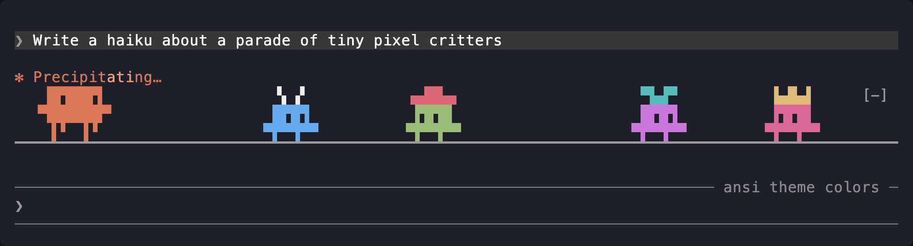

# prompt-posse

A Claude Code mod that puts a little parade above your prompt while Claude works. The boss walks back and forth, and every subagent Claude starts joins in as a creature of its own.



The whole lineup, as text:

```
 ▐▛███▜▌      ▝▖▗▘        ▗▄██▄▖        ▀▙▟▀         ▙▟▙▟         ▝▀▀▘
▝▜█████▛▘     █▜▛█         █▜▛█         █▜▛█         █▜▛█         █▜▛█
  ▌▌ ▐▐      ▀▛▛▜▜▀       ▀▛▛▜▜▀       ▀▛▛▜▜▀       ▀▛▛▜▜▀       ▀▛▛▜▜▀
▔▔▔▔▔▔▔▔▔▔▔▔▔▔▔▔▔▔▔▔▔▔▔▔▔▔▔▔▔▔▔▔▔▔▔▔▔▔▔▔▔▔▔▔▔▔▔▔▔▔▔▔▔▔▔▔▔▔▔▔▔▔▔▔▔▔▔▔▔▔▔▔
```

From left to right: the boss, the biggest of them, then the creatures for Explore, Plan, general-purpose, `claude` and fork subagents. The boss is drawn after Claude Code's mascot, with a shaded side at its back and dark eyes.

## What it does

- The boss appears when a turn starts and walks the full width of the prompt. At each edge it stops, looks at you, and turns around. It blinks now and then. It leaves once the turn has ended and no subagent is still walking.
- Each running subagent gets its own, smaller creature. Its headwear, body color and headwear color depend on the subagent's type:

  | Subagent type | Headwear | Body | Headwear color |
  | --- | --- | --- | --- |
  | main turn (the boss) | none; bigger than everyone else | orange, with a darker side at its back and dark eyes | — |
  | Explore | antennae | blue | white |
  | Plan | top hat | green | red |
  | general-purpose | propeller cap | purple | cyan |
  | `claude` | crown | pink | gold |
  | fork | halo | peach | pale yellow |
  | any other type | ears, horns, a mohawk or a sprout | picked from the type's name | picked from the type's name |

  A custom type always gets the same look, never headwear a built-in type wears, and never a hat the color of its body.
- The boss always walks at the same pace: 10 columns a second at the default speed. Each subagent's creature gets one of six paces, from 7 to 12 columns a second, picked from the subagent's id. In the terminal, when two meet, they stop briefly and turn around. In the desktop app they walk past each other.
- Subagents running in the background keep walking after the main turn ends, with the boss leading them. The strip disappears when the last one finishes.
- The mod checks which subagents are running whenever one starts, whenever a turn ends, and every half second while anything is walking. So a creature can arrive or leave up to half a second after its subagent starts or finishes.
- The strip steps aside while Claude Code is showing a survey, when there are fewer than 4 free rows above the prompt, or when it's under 8 columns wide, too narrow for the boss. It comes back when there's room again.

## Commands

- `/posse` switches the posse on or off. The setting is remembered across sessions.
- `/posse on` and `/posse off` pick one.
- `/posse legend` shows which creature is which.

The command runs right away, even while Claude is working and the posse is walking.

## Requirements

- Claude Code 2.1.289 or newer. The function-hook API this mod uses is in early access and may change between releases.
- The terminal or the Claude desktop app. VS Code and mobile don't draw the creatures.

In the terminal, the creatures are drawn in text characters and repainted 20 times a second. In the desktop app, they're one SVG that animates itself, so nothing is sent per frame. It's redrawn when a creature arrives or leaves, when a turn starts or ends, and when the window is resized. A resize changes how far each creature has to walk, so the creatures jump to new spots.

## Install

Clone the repo:

```sh
git clone https://github.com/RyanEmslie/prompt-posse.git
```

To try it in one session, point Claude Code at the folder:

```sh
claude --plugin-dir /path/to/prompt-posse
```

To load it in every session, add the folder's absolute path to the `env` block of `~/.claude/settings.json`:

```json
{
  "env": {
    "CLAUDE_CODE_PLUGIN_DIRS": "/path/to/prompt-posse"
  }
}
```

Sessions the desktop app starts read the same setting.

Interactive terminal sessions watch the folder, so edits reload in sessions that are already open. Desktop sessions only do that when `CLAUDE_CODE_PLUGIN_DIR_WATCH` is also set to `1`. Otherwise edits show up in new sessions.

## Customizing

- **Speed:** change `TICK_MS` in `hooks/walker.ts`. Lower is faster.
- **Looks:** edit `hooks/looks.ts`. Headwear is two text rows of 12 characters, with `#` for a filled pixel. Colors are `0xRRGGBB` values.
- **Body and legs:** the sprite is in `hooks/sprite.ts`, drawn the same way.
- **Desktop drawing:** `hooks/svg.ts` turns the same sprites into the animated SVG.

## Development

```sh
claude plugin validate .
claude plugin test .
```

What changed in each version is in [CHANGELOG.md](CHANGELOG.md).

## Known limits

- In the terminal, the `[-]` collapse button sits on the strip's top row, so near the right edge it briefly covers a creature's headwear.
- Colors are fixed RGB values. They don't follow your terminal's color scheme or the desktop app's theme.
- Claude Code keeps one empty row between the strip and the prompt box, so the creatures can't stand directly on the prompt's border. The ground line under them stands in for it.
- When more creatures are out than fit side by side, they walk through each other instead of bumping. At 80 columns that's the boss plus 10; at 120, the boss plus 16.
- A teammate running in its own terminal pane keeps reporting "running" if that pane dies, so its creature is retired after 10 minutes of running. A live teammate on one very long turn loses its creature too, until it next goes idle. If nothing was walking for a while, a retired teammate that's still listed as running comes back for another 10 minutes, since the mod can't tell whether it went idle in between.

## License

MIT. See [LICENSE](LICENSE).

This is an unofficial fan project, not affiliated with or endorsed by Anthropic. Claude and Claude Code are trademarks of Anthropic.
